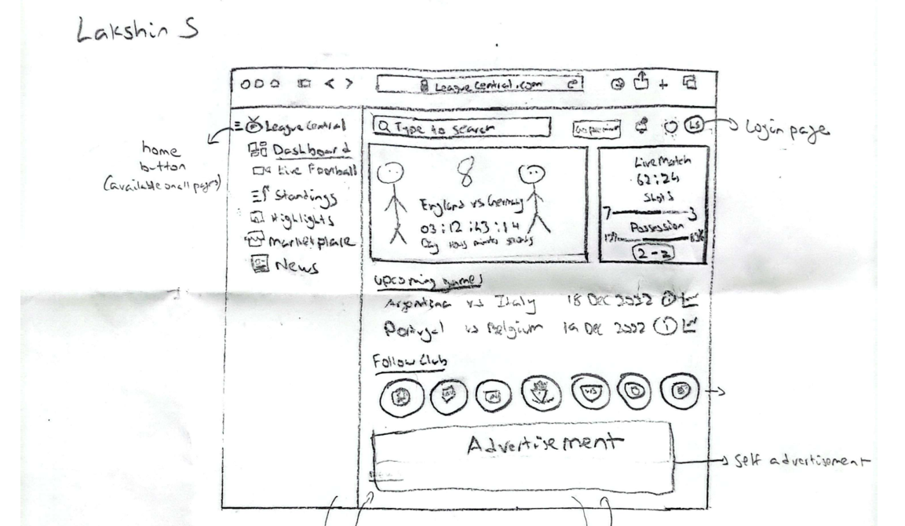
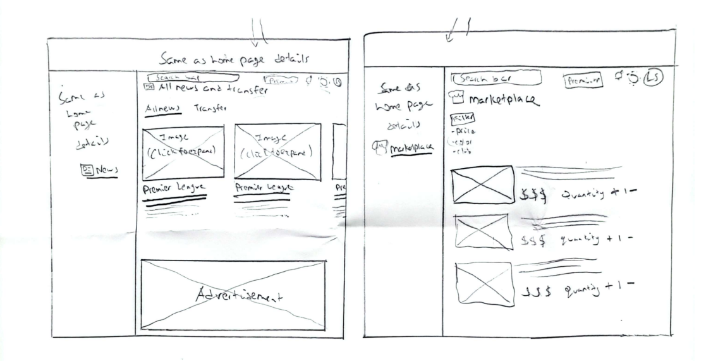
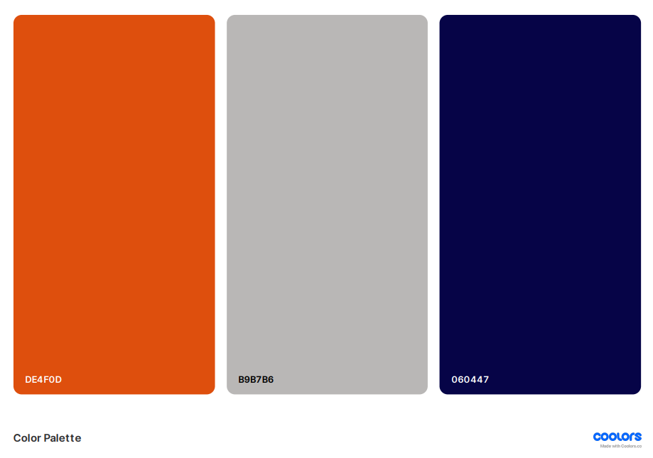

# League Central
## Website Overview
The increased global popularity and following of football has resulted in people seeking real-time match updates and detailed information about the matches, players, teams, and leagues. There are other existing solutions out there but they often lack integrations in live scores, schedules, league information, user experience personalization and a marketplace feature. Our website, **LeagueCentral**, aims to fill this need by providing a single window for all updates and information related to football, serving the needs of fans and enthusiasts.

Functional Requirements | Non-Functional Requirements
| ----------- | ----------- |
| User login and management | User Friendly UI |
| Forum and Post management | Secure Data Storage |
| Working marketplace | Secure Data Storage | 
| Forum and Post management | Secure Data Storage | 

## Basic Design of UI, Hierarchy and Interactive elements
### Wireframes

### Colour Palette

### Font
#### Option 1: Headings + Titles
Font: Oswald
Style: Condensed, bold, strong presence
Why: Perfect for headlines, scores, and breaking news

#### Option 2: Body Text
Font: Roboto
Style: Clean, neutral, highly readable on screens
Why: Ideal for paragraphs and match reports without causing eye strain