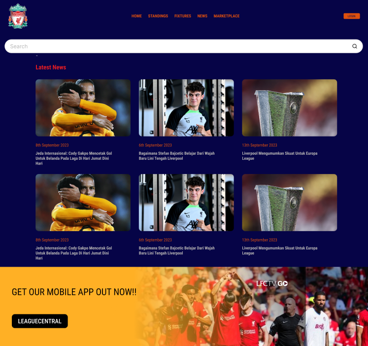

# League Central
## Website Overview
The increased global popularity and following of football has resulted in people seeking real-time match updates and detailed information about the matches, players, teams, and leagues. There are other existing solutions out there but they often lack integrations in live scores, schedules, league information, user experience personalization and a marketplace feature. Our website, **LeagueCentral**, aims to fill this need by providing a single window for all updates and information related to football, serving the needs of fans and enthusiasts.

Functional Requirements | Non-Functional Requirements
| ----------- | ----------- |
| User login and management | User Friendly UI |
| Forum and Post management | Scalable backend |
| Working marketplace | Aesthetically Pleasing | 
| Data Visualisation | Secure Data Storage | 

## Basic Design of UI, Hierarchy and Interactive elements
### Wireframes

### Colour Palette
Primary Colors:

- Purple Blue: #667eea (Main brand color)
= Purple: #764ba2 (Secondary brand color)

Status Colors:

- Success Green: #28a745
- Error Red: #ff4757
- Warning Orange: #ff9500
- Champions League Blue: #0066ff
- Gold/Champion: #ffd700 and #ffed4e

Gradient Used:

- Main Gradient: linear-gradient(135deg, #667eea 0%, #764ba2 100%)

This gradient is used for:

- Body background
- Headers
- Buttons
- Progress bars
- Accent elements

### Font
#### Option 1: Headings + Titles
Font: Oswald
Style: Condensed, bold, strong presence

Why: Perfect for headlines, scores, and breaking news

#### Option 2: Body Text
Font: Roboto
Style: Clean, neutral, highly readable on screens

Why: Ideal for paragraphs and match reports without causing eye strain

## Alternate Wireframe

### Home page - How is it different from the other design?
- Less elements on home page
- Colour palette and font considered

### Marketplace - How is it different from other design?
- Colour palette and font considered
- Included an advertisement 
- Added Filters section

#### Fixtures 

#### News - How is it different from the other design?
- Added 'transfers' news
- Color palette and font considered
- Included an advertisement
- Added a search bar
## Designing algorithms 
### Login page flowchart

### Test Case 1 - Successful Login

Test Case ID: TC01

Title: Verify user can successfully log in with valid credentials

Preconditions:

- User has an existing account

- User knows correct username and password

Test Steps:

1. Navigate to the football website home page.

2. Click on the “Sign In” button.

2. Enter a valid username in the “Username” field.

3. Enter the correct password in the “Password” field.

4. Click the “Login” button.

Expected Result:

- User is redirected to the homepage or dashboard.

- Welcome message displays with the user’s name.

- News feed loads correctly.

Priority: High

### Test Case 2 – Invalid Password Error Message

Test Case ID: TC02

Title: Verify error message appears when logging in with invalid password

Preconditions:

- User has an existing account

Test Steps:

1. Navigate to the football website home page.

2. Click on the “Sign In” button.

3. Enter a valid username in the “Username” field.

4. Enter an incorrect password in the “Password” field.

5. Click the “Login” button.

Expected Result:

- Login fails.

- A clear error message appears (“Incorrect login details”).

- A button appears ("Forgot Password?)

- No user session is created.

Priority: Medium

## Queries
1. List all users sorted alphabetically by username

SELECT User_id, Username, Email

FROM extension

ORDER BY Username ASC;

2. Find all users with email addresses from ".edu" domains

SELECT User_id, Username, Email

FROM extension

WHERE Email LIKE '%.edu';

3. Count how many users have emails from each domain

SELECT SUBSTRING(Email FROM POSITION('@' IN Email) + 1) AS Domain,

 COUNT(*) AS UserCount

FROM extension

GROUP BY Domain

ORDER BY UserCount DESC;

4. Find usernames that appear more than once (duplicates check)

SELECT Username, COUNT(*) AS Occurrences

FROM extension

GROUP BY Username

HAVING COUNT(*) > 1;

5. Find the top 5 most common email domains

SELECT SUBSTRING(Email FROM POSITION('@' IN Email) + 1) AS Domain,

 COUNT(*) AS TotalUsers

FROM extension

GROUP BY Domain

ORDER BY TotalUsers DESC

LIMIT 5;

6. Mask user passwords when displaying account details

SELECT User_id,

Username,

Email,
 
 CONCAT(LEFT(Password, 2), '*****') AS MaskedPassword

FROM extension;

7. Show the total number of users in the database

SELECT COUNT(*) AS TotalUsers

FROM extension;

## Development log
development log started in august 18th in line with course shift away from design towards development.
| date | work completed |
| --- | --- |
| 18/8  | started setting up development environment | 
| 19/8 | finished tempe hs tutorial on setting up development environment |
| 20/8 | started creating own tables in sqlite database |
| 22/8* | finished creating first table in database |
| 23/8* | finished creating second table in database and ran five unique test queries |
| 25/8 | started working through html and css styling tutorial |
| 25/8* | got localhost webpage to work, began styling with html and css |
| 26/8 | attempted to connect database with front end |
| 26/8* | successfully connected database to front end, continued styling and cleared errors |
| 27/8 | unsuccessfully attempted to style page to view data entries in a grid format
| 27/8* | continued styling page, including fixing data entries into grid format and creating floating sidebar using w3schools tutorial |
| 28/8* | added image
| 1/9 | fixed data entries showing with images and fixed width but caused merge error |
| 3/9* | fixed merge issue and adjusted file names

## Lighthouse reports
### September 4, 2025 (week 7)
- performance: 67-71 (due to long load times of assets and fonts, unfinished pages)
- accessibility: 100
- best practices: 94 (unfinished pages)
- seo: 83

### October 4, 2025 (week 1, school holidays)
#### Home page
- performance: 100
- accessibility: 88 (lack of alt text for images) 
- best practices: 100
- seo: 77 (links across the website too generic)

#### Log in page
- performance: 100
- accessibility: 100
- best practices: 88
- seo: 100

## Task list
- [x] continue documenting on README
- [x] incorporate multilple interactive elements
- [x] source multiple images and assets for my website
- [x] create a navbar that is on all pages to navigate between pages smoothly
- [x] learn how to integrate complex queries into python functions for displaying data
- [ ] finish styling all pages to sitewide theme and ensure functionality
    - [x] home page
    - [x] standings page
    - [x] marketplace page
    - [x] login page
    - [x] news page
    - [x] checkout page
    - [x] signup page
    - [x] privacy policy and terms pages
    - [x] forgot password page
- [x] user account features
    - [x] correct html input
    - [ ] integrate log in features and link to database
    - [x] style further pages - forgot password, sign up, terms and privacy policy
    - [x] account page functionality
- [ ] marketplace feature functionality
    - [x] incorporate a cart element and make it work
    - [x] add filters
    - [ ] add name and price and have a change quantity feature
    - [x] source images for each product
- [x] standings page 
    - [x] have 3 different leagues in a filters system with 20 teams 
    - [x] add recent matches and once clicked on shows up with match stats
    - [x] make it interactive - when you hover over something its changes colours
    - [x] link to database for real time match tracking
- [x] news page
    - [x] have multiple articles with text 
    - [x] include transfers news too 
    - [ ] include images for the articles

- [x] navbar
    - [x] functional links to other pages
    - [x] style it according to website aesthetic
    - [ ] include logo of Leaguecentral

## Deferred tasks - Unable to complete within timeframe

- [ ] include AI assistant
- [ ] offline functionality
- [ ] notifications on listed email 
- [ ] posting articles from famous organisations in news page 
- [ ] have a way to choose your favorite teams specifically and track them
- [ ] search bar feature
